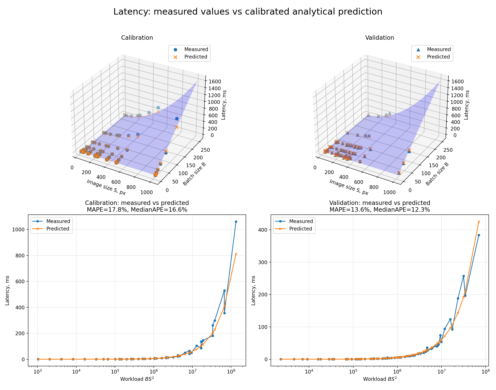
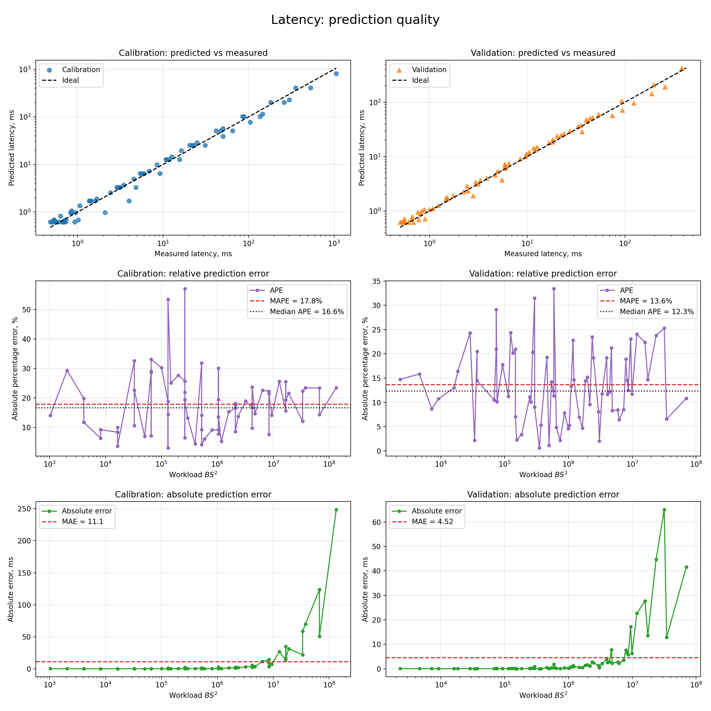
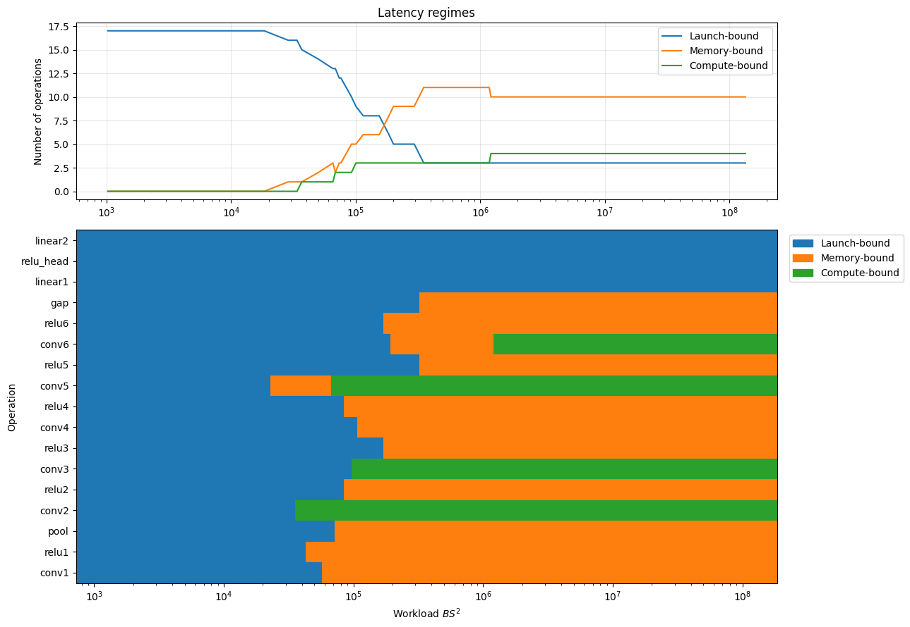
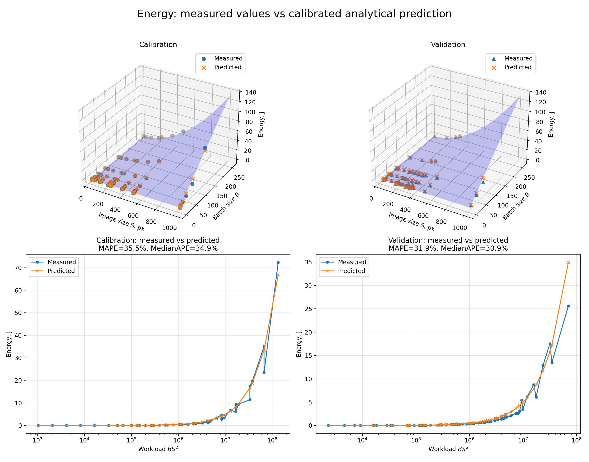
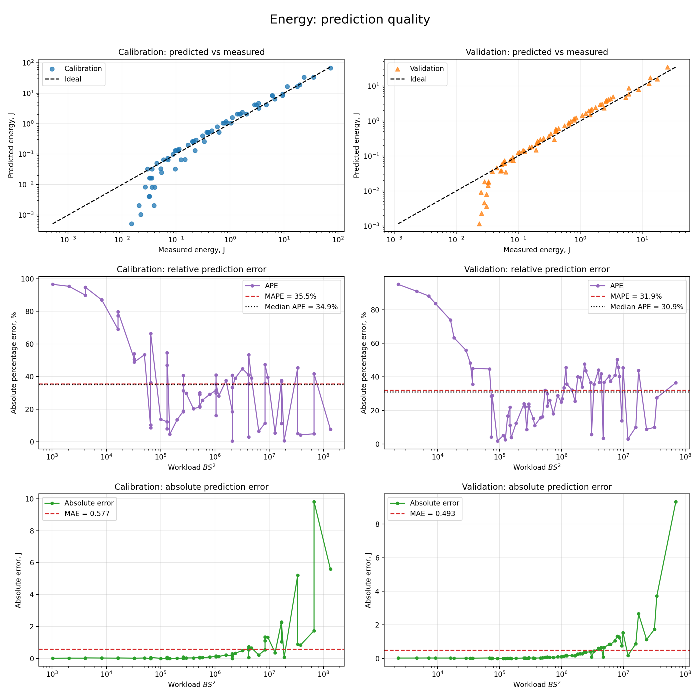
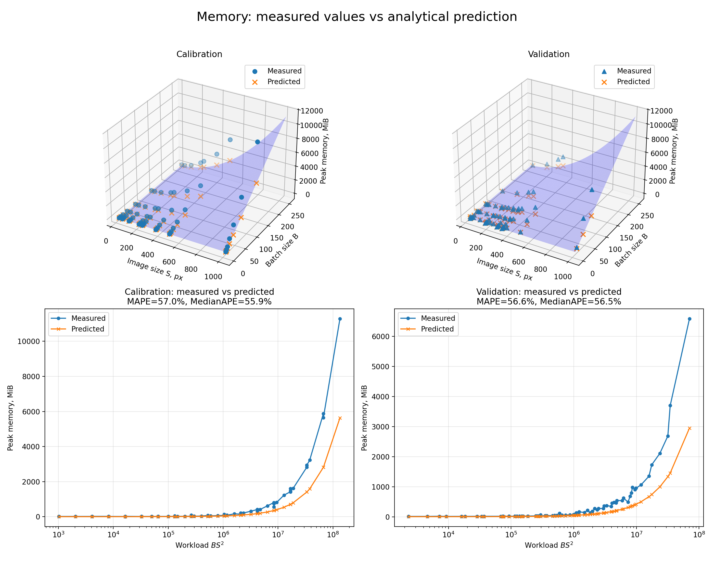
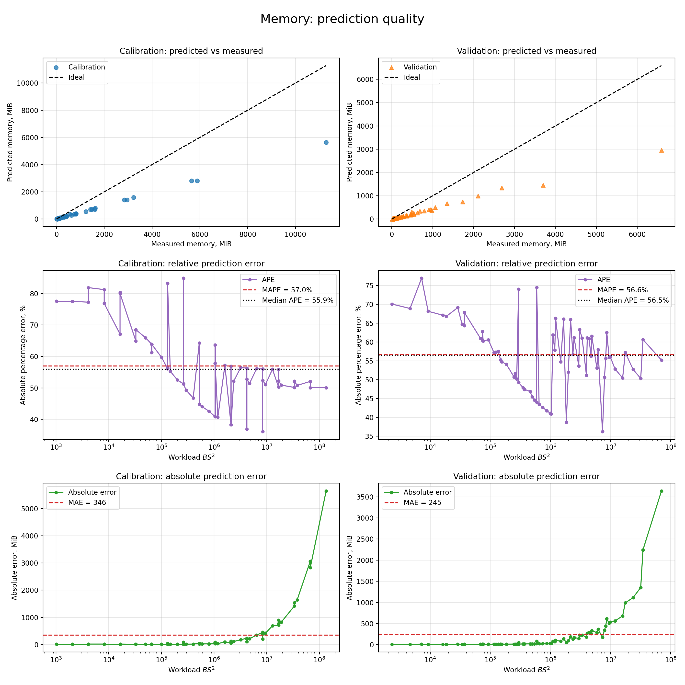

# HW1


### Окружение
Запускал все в colab с одной T4 15GB

- GPU: **Tesla T4**
- GPU memory: **14.56 GiB**
- PyTorch: **2.11.0+cu128**
- CUDA: **12.8**
- cuDNN: **91900**
- режим: **FP32**, `eval()` + `torch.inference_mode()`
- `cudnn.benchmark=False`, TF32 выключен

## tree

```text
hw_1/
├── models.py              # модель из условия
├── equations.py           # функции подсчета аналитически FLOPs / Memory / Bytes / Latency / Energy
├── measure.py             # реальные измерения на GPU
├── calibrate.py           # fit параметров + графики
├── hw1_handwritten.pdf    
└── results/
    ├── measurements.csv
    ├── theta.json
    └── figures/
        ├── latency_surface.png   # аналитическая поверхность + measured/predicted точки и кривые
        ├── latency_parity.png    # predicted vs measured + ошибки по workload
        ├── latency_regimes.png   # переход слоёв между launch/memory/compute-bound режимами
        ├── memory_surface.png    # аналитическая memory-модель против измерений
        ├── memory_parity.png     # predicted vs measured + ошибки memory-модели
        ├── energy_surface.png    # fitted energy-модель против измерений
        └── energy_parity.png     # predicted vs measured + ошибки energy-модели
```

## Полученные аналитические результаты
Вывод смотреть в <a href="hw1_handwritten.pdf">hw1_handwritten.pdf</a>
ReLU и MaxPool в FLOPs не учитываю, так как они в основном выполняют сравнения/выбор значения, а не floating-point arithmetic.

Получилась формула

\[
FLOPs(S,B)=17712BS^2+313344B.
\]

Для memory считаю параметры модели + одновременно живые вход/выход activations:

\[
Memory(S,B)=4(1040324+11BS^2).
\]

cuDNN workspace, внутренние временные буферы и поведение allocator'а в неё не входят (в аналитическом случае).

Для memory traffic считаю, что input/weights читаются, output записывается один раз, а inplace-ReLU делает read+write:

\[
Bytes(S,B)=4(91BS^2+2148B+1040324).
\]

Latency моделируется по слоям:

\[
T_l=\max\left(t_{launch},\frac{Bytes_l}{BW},\frac{FLOPs_l}{P}\right),
\qquad
T=\sum_l T_l.
\]

Для energy использую простую калибруемую модель

\[
E=P_0T+\epsilon_B Bytes+\epsilon_F FLOPs.
\]

## Как запустить

Из папки `hw_1`:

```bash
pip install torch numpy pandas scipy matplotlib nvidia-ml-py
python measure.py
python calibrate.py
```

`measure.py` создаёт `results/measurements.csv`, после чего `calibrate.py` подбирает параметры, сохраняет `results/theta.json` и строит графики.

Основная сетка из задания — **132 конфигурации**. Дополнительно я прогнал `S=1024` как stress-test, чтобы увидеть OOM; поэтому в сохранённом CSV 144 точки.

## Результаты

### Latency

После калибровки:

```text
t_launch ≈ 36.6 us
BW       ≈ 75.8 GB/s
P        ≈ 6.23 TFLOP/s
```

Качество:
- calibration MAPE: 17.8%
- validation MAPE: 13.6%
<p>
  
  
</p>

Для такой простой latency-модели с тремя параметрами результат считаю хорошим. Чтобы понять, за счёт чего именно меняется latency при росте workload, отдельно посмотрел, какой член

\[
T_l=\max\left(t_{launch}, \frac{Bytes_l}{BW}, \frac{FLOPs_l}{P}\right)
\]

доминирует для каждого слоя.

<p align="center">
  
</p>

На маленьких workload практически все операции launch-bound. С ростом \(BS^2\) activation-heavy и менее вычислительно интенсивные операции переходят в memory-bound режим, а наиболее тяжёлые convolution-слои (`conv2`, `conv3`, `conv5`, `conv6`) — в compute-bound. На больших workload одновременно присутствуют все три режима.

### Energy
После fit:
```text
p_0             ≈ 1.81e-12 W
energy_per_byte ≈ 1.05e-22 J/byte
energy_per_flop ≈ 2.81e-11 J/FLOP
```

Качество:
- calibration MAPE: 35.5%
- validation MAPE: 31.9%
<p>
  
  
</p>

Energy предсказывается заметно хуже latency. При fit `p_0` и `energy_per_byte` практически обнулились, поэтому основную часть энергии модель объясняет через FLOPs. Скорее всего причина в том, что FLOPs, bytes moved и latency на этой сетке сильно коррелируют между собой, поэтому их отдельные вклады плохо идентифицируются. Поэтому эти коэффициенты лучше воспринимать как effective fit parameters, а не как физические характеристики GPU.

### Memory
Качество:
- calibration MAPE: 57.0%
- validation MAPE: 56.6%
<p>
  
  
</p>

Memory-модель систематически недооценивает реальные пики. В аналитической формуле я учитываю параметры модели и одновременно живые активации, но не учитываю cuDNN workspace и временные CUDA-буферы. На больших S и B их вклад, видимо заметно растет, из-за чего и расхождение растёт.

## Итог

В целом latency простая roofline-модель описывает неплохо и нормально переносится на unseen `(S, B)`. Memory и energy заметно грубее: именно там сильнее проявляются детали реальной GPU-реализации, которых нет в закрытых формулах. Для меня это и есть основной вывод домашки — формулы хорошо ловят общий scaling и режимы работы, но не заменяют реальные измерения.
